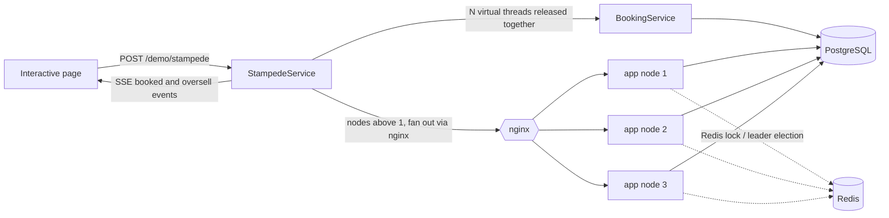
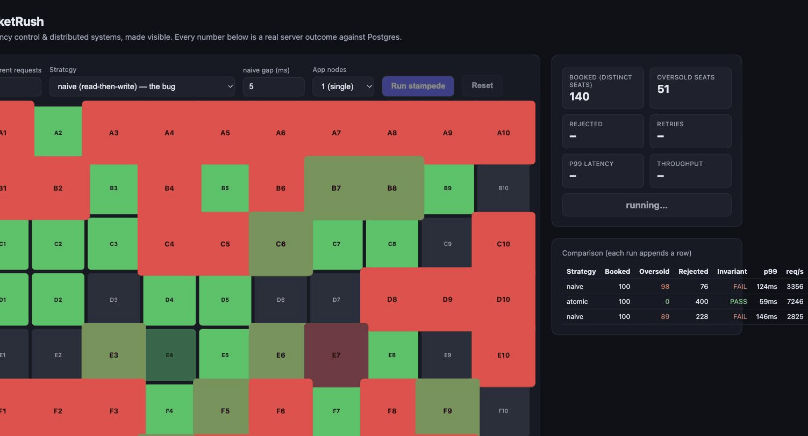
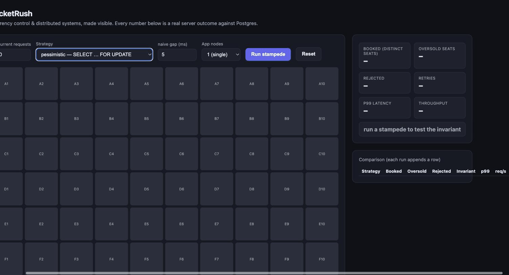
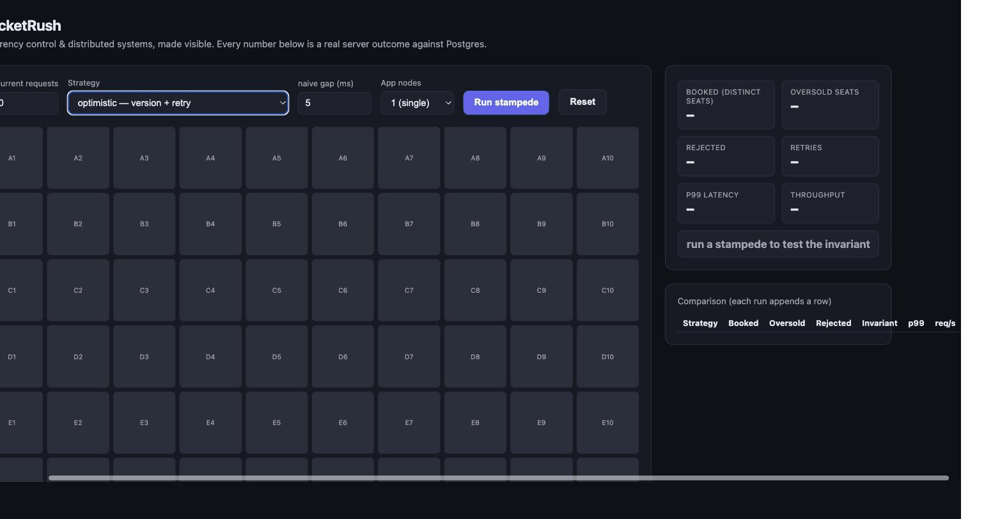
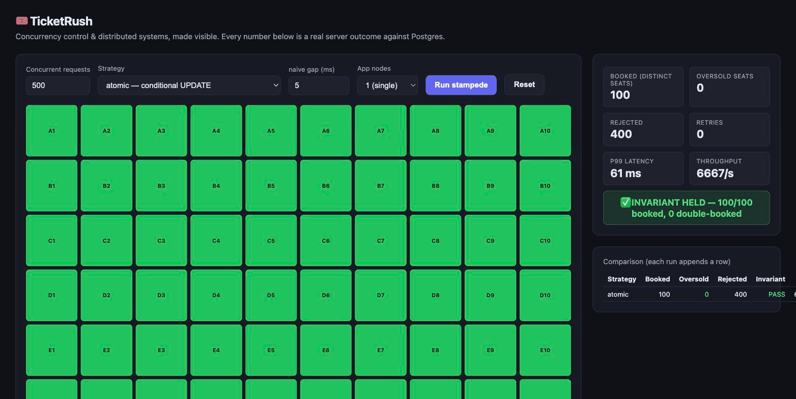
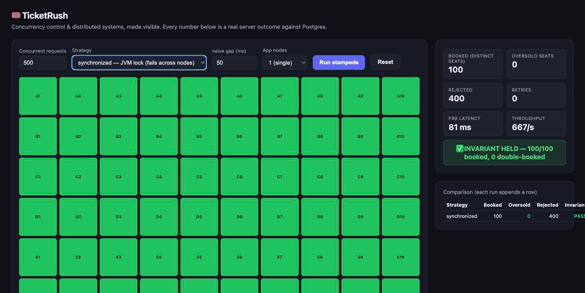
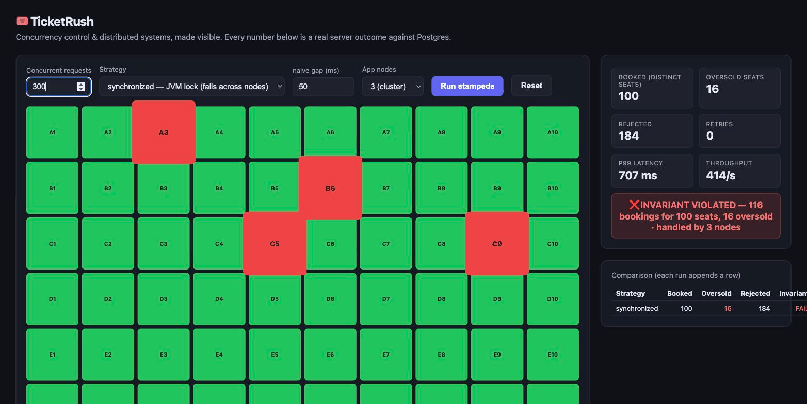
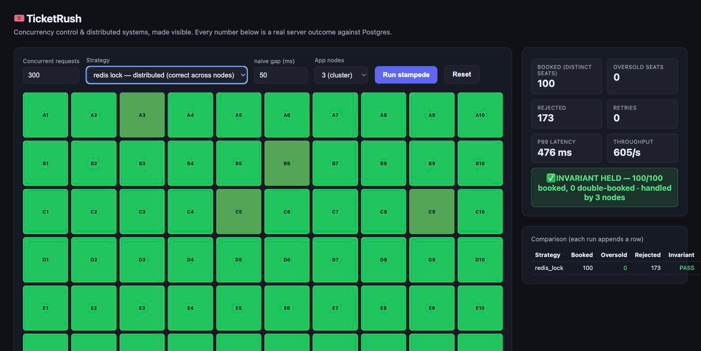

# 🎟️ TicketRush — concurrency & distributed systems, made visible

A seat-booking backend built to **demonstrate concurrency control**, driven by a single
interactive page. You spawn hundreds of *real* concurrent booking requests against a real
Postgres database, watch the classic **race condition oversell seats live**, then flip on a
fix and watch the invariant hold. **Every number on screen is an actual server outcome — not a
browser animation.**


> Kotlin · Spring Boot 3 · PostgreSQL · Redis · Java 21 virtual threads · Docker

---

## Table of contents
- [What it demonstrates](#what-it-demonstrates)
- [Quick start](#quick-start)
- [The strategies](#the-strategies)
- [How it works](#how-it-works)
- [API reference](#api-reference)
- [Test cases](#test-cases) — copy-paste commands with expected results
- [Project layout](#project-layout)

---

## What it demonstrates

| Concept | Where you see it |
|---|---|
| **Lost-update race condition** | the `naive` strategy — measured, not hand-waved |
| **Pessimistic locking** | `SELECT … FOR UPDATE` inside a transaction |
| **Optimistic concurrency** | a `version` column + compare-and-set + retry |
| **Atomic conditional write** | one-statement correctness, no explicit lock |
| **In-process vs distributed lock** | a JVM lock that works on 1 node but **oversells across 3** |
| **Distributed lock + fencing** | Redis `SET NX PX` coordinating all nodes |
| **Leases / TTL** | seat holds that auto-release when they expire |
| **Idempotency (effectively-once)** | a keyed confirm that books at most once under retries |
| **Leader election** | only one node runs the hold-expiry sweeper |
| **Invariant checking** | after every run: `bookings == distinct seats ≤ total seats` |

---

## Quick start

**Prerequisites:** Docker. (No local JDK/Gradle needed — it builds inside the image.)

### Single node — the fastest way in
```bash
docker compose up --build
```
Open **http://localhost:8080**, pick a strategy, hit **Run stampede**.

### The cluster — 3 nodes behind nginx (for the distributed demo)
```bash
docker compose -f docker-compose.cluster.yml up --build --scale app=3
```
Open **http://localhost:8080**, set **App nodes = 3**, then compare `synchronized` (oversells)
with `redis lock` (holds).

### Local dev (app in your IDE)
```bash
docker compose up -d db redis      # just the datastores
gradle bootRun                     # or run TicketRushApplication in IntelliJ
```

Stop everything with `docker compose down` (add `-f docker-compose.cluster.yml` for the cluster).

---

## The strategies

Default run = **500 concurrent requests for 100 seats**. Round-robin assignment means ~5
requests fight for each seat. The **invariant** is: no seat is booked more than once, and total
bookings ≤ total seats.

| Strategy | Mechanism | 1 node | 3 nodes |
|---|---|:---:|:---:|
| `naive` | read status, then write — no coordination | ❌ oversells | ❌ oversells |
| `pessimistic` | `SELECT … FOR UPDATE` (row lock) | ✅ | ✅ |
| `optimistic` | `UPDATE … WHERE version = ?` + retry | ✅ | ✅ |
| `atomic` | `UPDATE … WHERE status = 'AVAILABLE'` | ✅ | ✅ |
| `synchronized` | JVM lock around a naive body | ✅ | ❌ **oversells** |
| `redis lock` | Redis `SET NX PX` + fencing token | ✅ | ✅ |

The headline lesson is the last two rows: a `synchronized` block is correct on one node but
**each JVM has its own lock**, so across a cluster it oversells — only the Redis (distributed)
lock composes.

Beyond the stampede, two more demos on the page:
- **Hold seats (TTL):** reserve seats as *leases*; they turn yellow, then auto-release to grey
  when the lease expires (a leader-elected sweeper runs every second).
- **Idempotency test:** fire several identical confirmations (same key) at once → exactly one
  booking is created.

---

## How it works



**Honest concurrency:** browsers cap ~6 connections per host, so the real contention is
generated **server-side** — `StampedeService` launches N virtual threads that all block on a
start latch and are released at once. In cluster mode each request is sent through nginx so it
lands on a different node, which is what exposes the `synchronized` strategy.

**Key files:**
| File | Role |
|---|---|
| [`SeatRepository.kt`](src/main/kotlin/com/ticketrush/SeatRepository.kt) | the DB strategies + holds + metrics (the heart) |
| [`LockingBookings.kt`](src/main/kotlin/com/ticketrush/LockingBookings.kt) | JVM-lock and Redis-lock strategies |
| [`RedisLock.kt`](src/main/kotlin/com/ticketrush/RedisLock.kt) | `SET NX PX` acquire + safe release + fencing |
| [`StampedeService.kt`](src/main/kotlin/com/ticketrush/StampedeService.kt) | server-side load generator + cluster fan-out |
| [`HoldSweeper.kt`](src/main/kotlin/com/ticketrush/HoldSweeper.kt) | leader-elected TTL sweeper |
| [`SeatEventPublisher.kt`](src/main/kotlin/com/ticketrush/SeatEventPublisher.kt) | SSE fan-out for the live grid |
| [`static/`](src/main/resources/static/) | the interactive page |

---

## API reference

| Method | Path | Purpose |
|---|---|---|
| `GET` | `/` | the interactive page |
| `POST` | `/demo/stampede` | run the rush `{concurrency, strategy, gapMs, seatCount, nodes}` |
| `GET` | `/demo/stream` | SSE live events (`reset`, `booked`, `held`, `released`, `summary`) |
| `GET` | `/demo/state` | seats + booking counts (authoritative grid repaint) |
| `POST` | `/demo/reset` | clear bookings, mark all seats available |
| `POST` | `/demo/hold` | hold N seats for a TTL `{count, ttlSeconds}` |
| `POST` | `/demo/idempotency-test` | fire identical confirms; exactly one booking results |
| `POST` | `/internal/book` | book one seat on this node `{seatId, strategy}` (cluster fan-out) |

---

## Test cases

Every screenshot below is a **real run** against the live app (500 concurrent requests for 100
seats, naive gap 5ms unless noted). The **invariant**: `bookings == distinct seats booked` and
`≤ total seats`. Green = booked once, red = double-booked, yellow = held. Each `curl` reproduces
the same numbers from the CLI.

### 1. `naive` — read-then-write · ❌ oversells
Many requests read the seat as `AVAILABLE` before any write lands, so they all "succeed" — the
same seat is sold many times (lost update).



```bash
curl -s -X POST localhost:8080/demo/stampede -H 'Content-Type: application/json' \
  -d '{"strategy":"NAIVE","concurrency":500,"gapMs":5,"nodes":1}' | python3 -m json.tool
```
> **Expected:** `oversoldSeats > 0`, `invariantHeld: false`.

### 2. `pessimistic` — `SELECT … FOR UPDATE` · ✅ holds
A row lock serializes contenders; only the first sees the seat available.



```bash
curl -s -X POST localhost:8080/demo/stampede -H 'Content-Type: application/json' \
  -d '{"strategy":"PESSIMISTIC","concurrency":500,"nodes":1}' | python3 -m json.tool
```
> **Expected:** `oversoldSeats: 0`, `invariantHeld: true`, `rejected: 400`.

### 3. `optimistic` — version + retry · ✅ holds
No locks: each writer bumps a `version` and only commits if it's unchanged; losers retry.



```bash
curl -s -X POST localhost:8080/demo/stampede -H 'Content-Type: application/json' \
  -d '{"strategy":"OPTIMISTIC","concurrency":500,"nodes":1}' | python3 -m json.tool
```
> **Expected:** `oversoldSeats: 0`, `invariantHeld: true`, `retries > 0`.

### 4. `atomic` — conditional `UPDATE` · ✅ holds
A single `UPDATE … WHERE status='AVAILABLE'` — the database guarantees one winner. Fastest fix.



```bash
curl -s -X POST localhost:8080/demo/stampede -H 'Content-Type: application/json' \
  -d '{"strategy":"ATOMIC","concurrency":500,"nodes":1}' | python3 -m json.tool
```
> **Expected:** `oversoldSeats: 0`, `invariantHeld: true`, `retries: 0`.

### 5. `synchronized` — JVM lock · ✅ on 1 node / ❌ on 3 nodes
*(the cluster cases need `docker compose -f docker-compose.cluster.yml up --build --scale app=3`)*

**1 node** — the JVM lock serializes access, so it's correct:



**3 nodes** — each JVM has its **own** lock, so seats double-book across the cluster:



```bash
# 1 node → holds
curl -s -X POST localhost:8080/demo/stampede -H 'Content-Type: application/json' \
  -d '{"strategy":"SYNCHRONIZED","concurrency":500,"nodes":1}' | python3 -m json.tool
# 3 nodes → oversells
curl -s -X POST localhost:8080/demo/stampede -H 'Content-Type: application/json' \
  -d '{"strategy":"SYNCHRONIZED","concurrency":300,"gapMs":50,"nodes":3}' | python3 -m json.tool
```
> **Expected:** 1 node → `invariantHeld: true`; 3 nodes → `oversoldSeats > 0`, `invariantHeld: false`, `nodesSeen: 3`.

### 6. `redis lock` — distributed (`SET NX PX` + fencing) · ✅ holds across the cluster
All nodes coordinate through Redis, so exactly one holder books each seat — correct even on 3 nodes.



```bash
curl -s -X POST localhost:8080/demo/stampede -H 'Content-Type: application/json' \
  -d '{"strategy":"REDIS_LOCK","concurrency":300,"gapMs":50,"nodes":3}' | python3 -m json.tool
```
> **Expected:** `oversoldSeats: 0`, `invariantHeld: true`, `nodesSeen: 3`.

### 7. Idempotency — identical confirms create one booking
```bash
curl -s -X POST localhost:8080/demo/idempotency-test | python3 -m json.tool
```
> **Expected:** `"bookings": 1`, `"correct": true`, outcomes like `["BOOKED","REJECTED",...]`.

### 8. Hold lease auto-releases on TTL
```bash
curl -s -X POST localhost:8080/demo/hold -H 'Content-Type: application/json' -d '{"count":5,"ttlSeconds":3}'
curl -s localhost:8080/demo/seats | python3 -c "import sys,json;d=json.load(sys.stdin);print('HELD now:', sum(1 for s in d if s['status']=='HELD'))"
sleep 5
curl -s localhost:8080/demo/seats | python3 -c "import sys,json;d=json.load(sys.stdin);print('HELD after expiry:', sum(1 for s in d if s['status']=='HELD'))"
```
> **Expected:** `HELD now: 5` → `HELD after expiry: 0` (the sweeper released them).

---

## Project layout
```
src/main/kotlin/com/ticketrush/
  TicketRushApplication.kt   app entrypoint (@EnableScheduling)
  SeatRepository.kt          DB strategies, holds, metrics
  LockingBookings.kt         JVM-lock + Redis-lock strategies
  RedisLock.kt               distributed lock (SET NX PX + fencing)
  BookingService.kt          maps Strategy -> implementation
  StampedeService.kt         server-side load generator + cluster fan-out
  HoldService.kt             hold + idempotency demos
  HoldSweeper.kt             leader-elected TTL sweeper
  SeatEventPublisher.kt      SSE fan-out
  DemoController.kt          /demo/*  ·  InternalController.kt  /internal/book
src/main/resources/
  static/                    the interactive page (index.html, app.js)
  schema.sql                 seat + booking tables
docker-compose.yml           single node (app + Postgres + Redis)
docker-compose.cluster.yml   3 app nodes + nginx + Postgres + Redis
```
